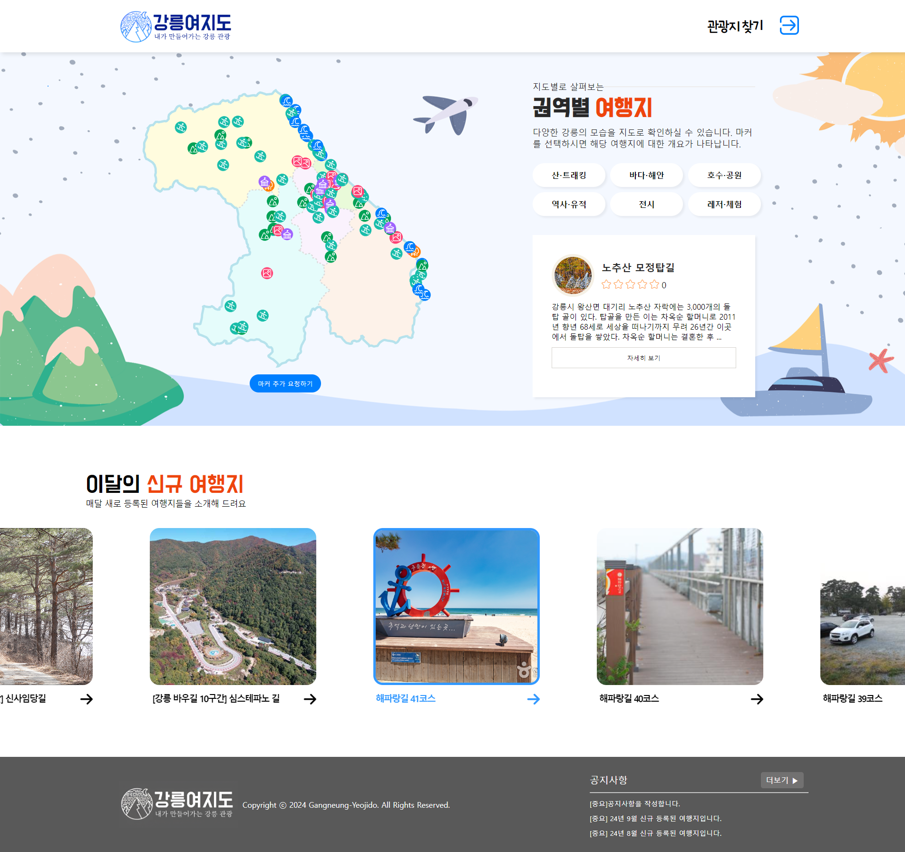

# 강릉 여행지 정보 제공 및 리뷰 중심 커뮤니티 사이트

## 팀 소개


## 팀원 소개


## 기획의도


## 차별성


## 개발일정


## 프로젝트 개발환경

- DB는 오라클 11g XE 버전을 이용하였습니다.
- 프론트엔드 & 백엔드 개발은 Intellij IDEA Ultimate 버전을 이용하여 개발하였습니다.

## 프로젝트 실행 방법

1. 오라클 11g를 설치한 후에 application.yml 에 있는

```
spring.datasource.username
```
```
spring.datasource.password
```

를 참고해서 계정을 만듭니다. 
이때
```
spring.datasource.url
```
을 확인해서 spring.datasource.url 을 변경한 후에 거기에 계정을 만드는 걸로 합니다.
2. 그 계정에 RESOURCE, CONNECT 권한을 부여합니다. 
3. [CREATE SQL](./GNTOUR_CREATE.sql) 를 참고해서 테이블을 구성합니다.
4. [INSERT SQL](./INSERT_TRAVEL_INFO.sql) 를 참고해서 데이터를 구성합니다.
5. 환경변수를 다음과 같이 설정합니다.
```
GANGNEUNG_UPLOAD_FOLDER_PATH: [업로드할 폴더 경로] +"/"
EMAIL_APP_ID: [GMAIL 계정]
EMAIL_APP_PW: [GMAIL APP PASSWORD]
```
6. 그런다음 Intellij 에서 실행을 합니다.

## 기술 스택


<br>


<br>


## 주요기능
### 회원관리

|기능명|상세|
|--|--|
|회원 가입|아이디, 비밀번호, 이름, 생년월일, 이메일, 전화번호를 입력 후 가입하며 자신의 계정을 생성합니다. 아이디는 중복 체크를 해야 합니다. 이메일은 인증이 되어야 합니다. 회원가입 폼에는 일정한 형식을 지켜야 하며 만약 지키지 않을 시 오류가 납니다. |
|회원 관리|필요시 계정 정보를 수정할 수 있습니다. 계정 정보를 수정할 수 있는 범위는 비밀번호, 전화번호 만이며 이것도 역시 일정한 형식을 지켜야 합니다. 만약 더 이상 서비스를 이용하고 싶지 않다면, 계정 탈퇴를 할 수 있습니다. 회원 관리 서비스는 모두 로그인이 되어 있어야 합니다. 때로는 다시 로그인을 요구할 수 있습니다.|
|로그인 및 로그아웃|로그인하여 사이트의 리뷰와 댓글 작성, 수정 및 삭제, 즐겨찾기 추가, 수정 및 삭제, 일기 작성, 수정 및 삭제 여행지 마커 추가, 수정 및 삭제 등의 기능을 사용할 수 있으며, 비회원은 여행지 정보 및 리뷰 열람 등 기본적인 기능만 제한적으로 사용할 수 있습니다. 사용 후에는 로그아웃을 통해 계정을 안전하게 보호할 수 있습니다.|
|관리자 로그인 및 블랙리스트 관리|관리자는 별도의 관리자 계정을 통해 사이트에 로그인하여 사용자 관리, 콘텐츠 관리(수정 및 삭제) 등의 추가적인 기능을 수행할 수 있습니다. 특정 사용자가 사이트의 규칙을 위반하거나 문제가 있을 때 관리자는 해당 사용자에게 경고를 줄 수 있으며 2회 반복 시 블랙리스트에 추가하여 마커 추가, 리뷰 및 댓글 작성 등의 사이트 이용을 제한할 수 있습니다.|

### 마이페이지

|기능명|상세|
|--|--|
|즐겨찾기 조회/삭제|사용자는 즐겨찾기 한 여행지에 대한 정보를 조회 및 삭제를 할 수 있습니다.|
|즐겨찾기 정렬|기준에 따라 내림차순이나 오름차순 정렬을 할 수 있습니다. 기준은 즐겨찾기 등록을 한 시점입니다.|
|여행 일기|사용자가 여행지에 대한 일기를 작성 할 수 있고, 수정, 삭제를 할 수 있습니다. 일기에서 아이템 클릭시 여행지 정보 조회 및 리뷰 페이지로 이동할 수 있습니다. 일기 작성을 할 때는 제목, 내용, 날짜, 첨부파일(선택)을 업로드 할 수 있습니다.|
|내가 작성한 리뷰|사용자가 작성했던 리뷰의 목록을 볼 수 있고,수정,삭제를 하기위해서 여행지 상세조회 리뷰탭으로 이동합니다.|

### 지도 기반 여행지 정보 조회

|기능명|상세|
|--|--|
|지도 기능|사용자는 지도에서 마커를 확인할 수 있습니다. 사용자는 지도에 적절한 조작을 가해 지도의 뷰를 변경할 수 있습니다. 지도는 권역별(주문진권, 시내권, 경포권, 대관령권, 정동진옥계권) 으로 나뉘어서 보여집니다. 그리고 마커도 카테고리에 맞는 이미지로 보입니다.|
|여행지 개요 조회|사용자는 지도에서 마커를 클릭하면 여행지 개요(간단한 정보, 별점) 을 확인할 수 있습니다. 여기에서 간단한 정보는 [여행지 이름, 여행지 소개] 등으로 한정합니다.|
|마커 추가 요청|사용자는 마커 생성 요청을 할 수 있습니다. 마커 생성을 요청할 때 여행지 세부 정보에 들어갈 만한 내용들 입력 받도록 합니다. 관리자는 생성 요청을 받은 데이터를 확인해 이 데이터를 추가할지 아니면 거절할 지 선택할 수 있습니다. 블랙리스트 같은 경우 마커 추가 요청을 할 수 없습니다.|
|여행지 필터 기능|여행지에 대한 필터 기능을 제공합니다. 지도 페이지에서 카테고리(산·트래킹, 바다·해안, 호수·공원, 전시, 역사·유적, 레저·체험) 필터를 선택하면 선택한 필터를 제외한 나머지 마커들은 지도에서 보이지 않게 합니다.|

### 여행지 리스트 조회

|기능명|상세|
|--|--|
|여행지 목록 조회|사용자가 여행지를 목록으로 조회할 수 있는 기능으로, 현재 등록되어 있는 강릉시의 전체 관광지를 썸네일로 살펴 볼 수 있습니다.|
|여행지 검색 기능|리스트의 오른쪽 상단에 있는 검색창을 통해 사용자는 여행지 이름을 입력하는 방식으로 원하는 여행지를 찾을 수 있습니다.|
|여행지 필터 기능|검색창의 우측에는 필터 아이콘이 있고 클릭 시 강릉시의 세부지도와 카테고리를 선택할 수 있는 팝업창이 뜹니다. 사용자는 권역별(주문진권, 시내권, 경포권, 대관령권, 정동진 옥계권) 또는 카테고리(산·트래킹, 바다·해안, 호수·공원, 전시, 역사·유적, 레저·체험)를 선택(복수 선택 가능)하여 원하는 정보를 찾을 수 있습니다.|
|여행지 즐겨찾기 기능|썸네일 오른쪽 상단에 있는 별표 이모티콘을 통해 즐겨찾기로 설정하거나 해제할 수 있습니다. 여행지 세부 정보 조회 페이지에서도 즐겨찾기를 설정하거나 해제할 수 있습니다.|

### 여행지 세부 정보 조회

|기능명|상세|
|--|--|
|여행지 정보|주소, 전화번호, 이용시간, 주차요금, 입장료, 시설 이용료, 공간소개글을 조회할 수 있습니다.|
|여행지 리뷰|기존에 작성되어 있는 리뷰를 최신순으로 조회할 수 있고, 각각의 리뷰에 댓글을 남길 수 있습니다. 여행지에 대한 별점과 리뷰(추가, 수정, 삭제)를 남길 수 있습니다. 리뷰 작성 시 첨부파일을 최대 5장 추가할 수 있습니다. 작성된 리뷰에 댓글을 남겨 댓글창을 열고 닫을 수 있습니다. 리뷰랑 댓글 신고 버튼이 있어 신고 사유를 선택하면 신고된 내용을 관리자가 보고 판단하에 삭제하거나 사용자를 제재할 수 있습니다.|

### 공지사항

|기능명|상세|
|--|--|
|공지사항 등록/수정|공지사항의 작성 및 수정의 권한은 모든 사용자가 아닌 관리자에 의해서만 가능하며, 공지사항 작성 시 주요 공지사항일 경우 기간을 정하여 1~3개까지 상단에 고정 노출되도록 선택할 수 있는 기능이 있습니다. |
|공지사항 리스트 조회 및 검색 기능|유저(회원+비회원)는 공지사항을 확인할 수 있으며, 공지사항의 개수가 많거나 찾고자 하는 내용이 있을 경우 검색창을 통해서 ‘제목’, ‘내용’ 항목을 선택하여 공지사항을 검색할 수 있습니다.|

### QnA

|기능명|상세|
|--|--|
|QnA 조회|사용자는 여태까지 자신이 작성한 QnA 에 대해서 페이징 형식으로 확인할 수 있습니다. 등록일, 제목, 답변 상태, 답변 등록일을 확인할 수 있습니다. 관리자는 사용자가 등록한 QnA 들을 확인할 수 있습니다.|
|QnA 작성/삭제|질문에 대한 작성 및 삭제 권한은 회원으로 한하며, 로그인이 되어있지 않을 경우 로그인을 해달라는 경고창을 띄워  로그인을 유도하도록 합니다. 질문 작성 시 첨부파일을 추가하여 질문을 할 수 있으며, 질문 삭제는 자신의 글만 삭제할 수 있도록 제한합니다. |
|QnA 답변|사용자에게 받은 질문에 대한 답변은 관리자만 할 수 있습니다. 사용자는 질문에 대한 답변을 마이페이지의 링크를 통해서 확인할 수 있습니다.|
|QnA 답변 삭제|사용자, 관리자는 자신이 단 QnA 답변에 대해서 삭제할 수 있습니다.|

## 화면 구현

### 1. 메인



### 2. 마커 추가 요청


### 3. 로그인


### 4. 회원 가입


### 5. 아이디 찾기


### 6. 비밀번호 찾기


### 7. 여행지 리스트


### 8. 여행지 상세정보 - 정보창


### 9. 여행지 상세정보 - 리뷰창


### 10. 리뷰, 댓글 등록/수정


### 11. 리뷰 신고


### 12. 마이페이지 - 즐겨찾기 리스트


### 13. 마이페이지 - 리뷰 조회


### 14. 마이페이지 - 나의 여행일기 목록 조회


### 15. 마이페이지 - 나의 여행일기 상세 조회


### 16. 마이페이지 - 나의 여행일기 등록/수정


### 17. 공지사항 리스트 조회


### 18. QnA 작성


### 19. 관리자


## 프로젝트 아키텍처
### 사용자 흐름도

### 서버 흐름도


화살표 방향은 의존 관계를 의미합니다. 컨트롤러는 서비스에 의존하지만 서비스는 컨트롤러에 의존하지 않습니다. 서비스는 Mapper 에 의존하지만 Mapper 는 서비스에 의존하지 않습니다. 컨트롤러, 서비스, Mapper 는 모두 ExceptionHandler 에 의존하며 ExceptionHandler 는 컨트롤러, 서비스, Mapper 에서 발생하는 Exception 들을 처리합니다.

## 프로젝트 산출 문서

- [기획보고서](https://drive.google.com/file/d/1xKrU_t2bgH5kuLAPBtYMu1aJZBpiE3gd/view?usp=drive_link)
- [요구사항기술서](https://docs.google.com/document/d/1LqVcKy8FHG2ugpnxaTy_QwyCWoX31h1mcSsShtPUOB4/edit?usp=drive_link)
- [유스케이스](https://drive.google.com/file/d/1WB3xDanCUE0NQFH3LHTC2ihIcdZfGzNw/view?usp=drive_link)
- [플로우차트](https://drive.google.com/file/d/1hYaTB7DO7Z1tuPH41Wwg9M8V-NbyJLdf/view?usp=drive_link)
- [와이어프레임](https://drive.google.com/file/d/1P0DsMKzsjJVSnkOympN18StspgC6Ms2x/view?usp=drive_link)
- [DB설계](https://drive.google.com/file/d/1UZWH7P_JEf8C3pm4v6jnvyxpJ8qOUPNi/view?usp=drive_link)
- [테이블정의서](https://docs.google.com/spreadsheets/d/1elBWKfCcjNKvqUCYvIl5JVw6l8x-WuQF/edit?usp=drive_link&ouid=116644278771318603851&rtpof=true&sd=true)
- [클래스다이어그램](https://drive.google.com/file/d/1bQzmqw-LqOEKO0bWhPJpuFwQkBkj5k0R/view?usp=drive_link)
- [시퀀스다이어그램](https://drive.google.com/file/d/1zjxBG0hJ0Key97xxHZz29U9rmtLG6t6n/view?usp=drive_link)
- [최종보고서](https://drive.google.com/file/d/1yWmMtOqoFn7DF0qPl9h6ayW_AUK1gQFf/view?usp=drive_link)
- [프로젝트 소스 DB](https://drive.google.com/file/d/1QAztOddYWz0mndtvfkSmkG8T9M61E56T/view?usp=drive_link)
- [시연영상](https://drive.google.com/file/d/1JID-QHkuA2Ul_8XNnFRgQY_ERgKv5f03/view?usp=drive_link)
